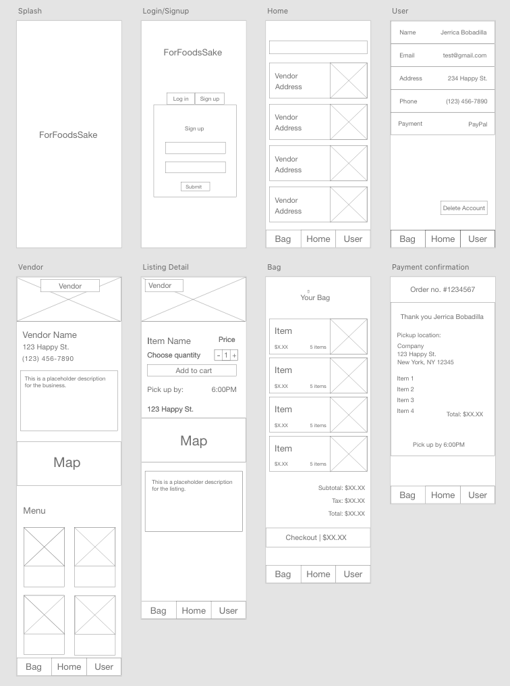
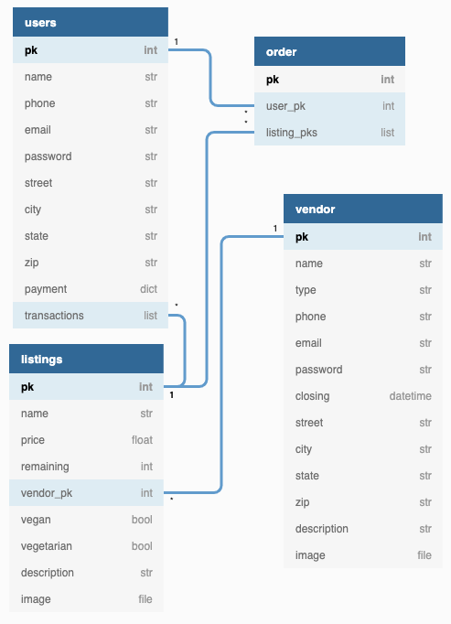

# Project 4 Planning

## Overview

The idea for the project came about through a mixture of activism and sustainability.
Our main focus was to create a project to promote waste reduction and food management.
We consider this is our contribution to moving ideas with forward thinking and in balance with nature.

## About

Food waste is a real problem in our society. In the United States, 40% of all food gets wasted.
For Food's Sake is an app made to alleviate some of that waste from those farms, markets, restaurants and homes.

### Who will use it?

- Proactive people whoa are conscious about the impact the human footprint has on the environment.
- Anybone who eats and is looking for a good deal.

#### Vendors/backend:

- Farms/markets/Groceries stores/Convenient stores/restaurants

##### Reasons to use:

- Saves Money
- Reduce waste
- Its sustainable
- Its Ethical
- Provides food at a reasonable price

#### Consumer:

- Proactive people conscious about environment who want a chance to help reduce food waste.

## Wireframes



## User Story

## Goal

### Functionality

#### Buyer

- Login
- Search by type of food, type of vendor, location near you, vendor name.
- Select listing and process transaction
- Recieve confirmation with scheduled time and place

* Fields: Name, email address, phone number, address, past transactions (Gold).
* Home page contains postings made around your location

#### Seller

- Fields: Name, organization name, email address, phone number, address, past transactions (Gold).

## User Flow Data


## Workflow and Responsabilities

## Request Response Cycle


## Component Hiearchy Diagram


## Database Diagram



## Minimum Viable Product

**Bronze version**

- [ ]

**Silver version**

**Gold version**

**Platinum version**

### Technologies used

**Front-end**

- React
  - React Router
- Material-UI (maybe)

**Back-end**

- Python
- Django
- PostgresSQL
- Google Maps API

### Why we chose this app???

`I feel the app is a call to action`
\- Rixio Barrios

`I'm hoping one day I can make a shit ton of money off this`
\- Qusai Fares

`The more resources people have to make a difference, the easier it is to make a difference. DIFFERENCE`
\- Sage Kearney

`To create an app that is a driving force for change, where people who are conscious about their impact can come together.`
\- Mindy Marmol

```PY
def food_listing(request):
    listings = Listing.objects.all()
    return # Response generate by our API
```
