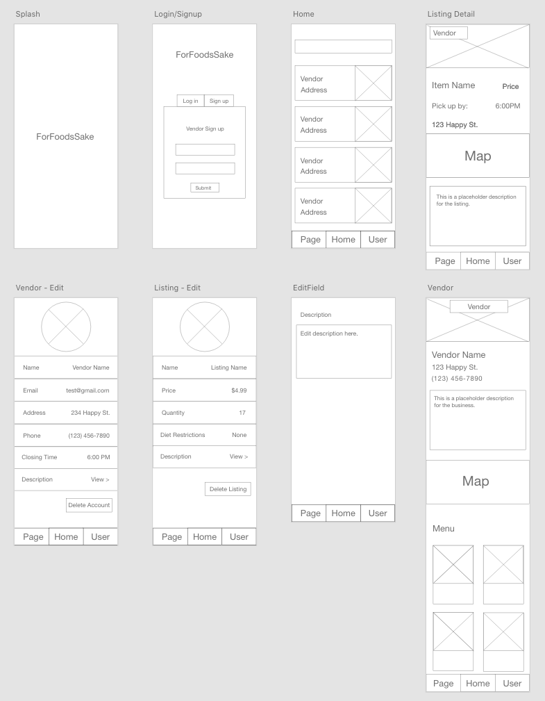

# Project 4 Planning

## Install

You can also download this repo, install it on your machine and install dependencies(code here)(e.g nmp install).

## Overview

The idea for the project came about through a mixture of activism and sustainability.
Our main focus was to create a project that promotes waste reduction through food management.
We consider this project our contribution to creating a more sustainable future for all.

## About

Food waste is a major problem among developed nations. In the United States, 40% of all food goes to waste.
For Food's Sake is an app that would help alleviate some of that waste from farms, markets, restaurants and homes.

### Who will use it?

- Proactive people who are conscious about the impact that human footprint has on the environment.
- Vendors who want to reduce food waste and dedicate a portion of their business to sustainability.
- Anybone who enjoys eating and is looking for a good deal on delicious food.

##### Reasons to use:

- Saves Money
- Reduces food waste
- Promotes community activism and sustainability
- Handles food waste in an ethical manner
- Provides quality foods for low income families

## Wireframes



## User Story

**Vendor**

The vendor (farm, grocery store or restaurant) will signup; enter their information, and post information about the items they have available (price and units available).

**Customer**

MVP- The customer would be able to see listings from vendors nearby and be able to get in touch with the vendor to arrange order and pickup.

SILVER- The customer would be able to see listings from vendors nearby. Choose the items they would like to purchase. Make a payment and then proceed to pickup time and contact information for vendor.

## User Flow Data


## Workflow and Responsabilities

## Request Response Cycle


## Component Hiearchy Diagram


## Database Diagram


### Functionality

**Minimum Viable Product**

**Bronze version**

- [ ]
- [ ]

**Silver version**

- [ ]

**Gold version**

- [ ]

**Platinum version**

- [ ]

### Technologies used

**Front-end**

- React
  - React Router
  - React Hooks
- Material-UI (maybe)
- Amazon Web Services(AWS)
- Javascript
- Cascading Style Sheets(CSS)

**Back-end**

- Python
- Django
  - Django REST Framework
- JSON Web Tokens (JWT)
- PostgresSQL
- Google Maps API

**Testing**

### Why we chose this app???

`I feel the app is a call to action`
\- Rixio Barrios

`I'm hoping one day I can make a shit ton of money off this since I am a greedy basterd`
\- Qusai Fares

`The more resources people have to make a difference, the easier it is to make a difference. DIFFERENCE`
\- Sage Kearney

`To create an app that is a driving force for change, where people who are conscious about their impact can come together.`
\- Mindy Marmol

```PY
def food_listing(request):
    listings = Listing.objects.all()
    return # Response generate by our API
```

** This code helps us do (reasons here)**

## How to Contribute

If you would like to contribute to this project feel free to create an issue on this repository:


## Credits
